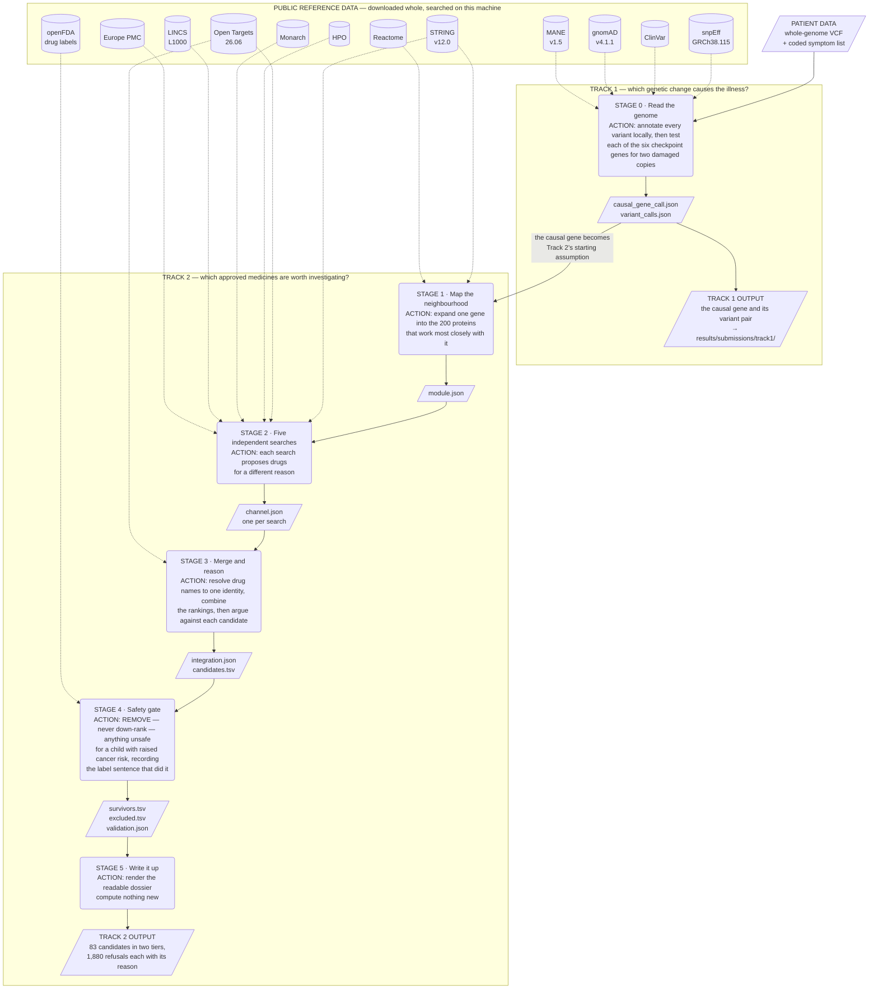
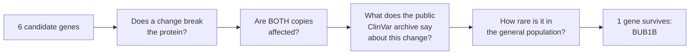

# How this project works — in plain language

**Rare Disease, Real Kid: MVA Hackathon 2026**

This is the non-technical explanation of what I built, what it found, and — just as
importantly — what it failed to find. There is no jargon here that I do not explain, and no
number that does not come from a file the code produced.

If you want the technical versions instead, they are [`report_track1.md`](report_track1.md)
and [`report_track2.md`](report_track2.md).

> **The short version.** A child has an ultra-rare genetic illness with no treatment. I
> built a program that reads that patient's genome and does two things: it works out which
> gene is most likely responsible, and it searches every approved medicine in the world for
> ones that might be worth *investigating*. The first part produced a clear answer. The
> second part produced a shortlist of 83 — and its most useful output is the 1,880 medicines
> it **refused**.
>
> Nothing here is a treatment recommendation. Nothing here has been tried on a person.

---

## 1. The illness

Cells are supposed to divide with exactly the right number of chromosomes — 46 in a human
cell, 23 from each parent. There is a checking mechanism inside every dividing cell that
holds division until the chromosomes are lined up correctly. Think of it as a safety catch.

In **mosaic variegated aneuploidy** (MVA), that safety catch is broken, because both copies
of one of the genes that build it are damaged. Cells divide anyway, and they come out with
the wrong number of chromosomes. Different cells end up wrong in different ways — which is
what "mosaic" and "variegated" mean. The consequences include restricted growth, a small
head, developmental delay, and a substantially raised risk of cancer in childhood (Hanks et
al., 2004; Scott et al., 2006).

Roughly **fifty people in the world** are known to have it. There is no treatment that
addresses the underlying cause. Care consists of treating symptoms and watching closely for
cancer.

Three consequences of that rarity shaped everything I built:

- **The databases barely know this disease exists.** Most drug-discovery methods work by
  looking up a disease and finding what is already connected to it. Here, that returns
  almost nothing.
- **There is no way to check if an answer is right.** No drug has ever been shown to work
  for MVA. So there is no answer key — I can only ask whether a method is *defensible*, not
  whether it is *correct*.
- **The patient is a child who is already prone to cancer.** A medicine that damages DNA is
  not merely a weak candidate here; it is actively the wrong direction. Safety could not be
  a scoring factor to be traded off. It had to be a locked door.

---

## 2. The two questions

The hackathon asked two separate things, and I entered both.

| | The question | My answer |
|---|---|---|
| **Track 1** | From this patient's genome, which genetic change causes the illness? | A specific pair of changes in one gene, *BUB1B* |
| **Track 2** | Which existing, approved medicines are worth investigating? | 83 candidates, in two clearly separated tiers |

The two are connected: Track 1's answer is the starting assumption for Track 2. You cannot
look for a drug that fixes a problem until you have decided what the problem is.

---

## 3. The machine, in one picture

The program runs in six stages. Each stage says what it reads, what it does to it, and what
it writes — and what it writes is a file on disk, which the next stage reads. Nothing is
hidden in someone's head or in a notebook.

The two bordered boxes are the two tracks. **Stage 0 sits inside Track 1 because finding the
causal gene *is* Track 1's answer** — and the same answer is the assumption everything in
Track 2 is built on, which is why one arrow crosses from the first box into the second.

**Reading the shapes.** Slanted boxes are **data** — what goes in, and every file that comes
out. Rounded boxes are **actions**. Cylinders are **stored reference data**. Solid arrows
carry the patient's data and everything derived from it; dotted arrows bring in public
reference data. No dotted arrow ever runs backwards, which is the privacy property drawn as
a picture: every reference database is fetched in full and searched here, so no part of the
patient's genome is ever sent anywhere.

Two things the picture makes plain. **Every stage writes a named file**, so any number in
this document can be traced to the file it came from. And **LINCS is wired in but its search
produces nothing** — Stage 2's signature search was built, tested and switched off, which
Section 7 explains.

The design idea behind Stage 2 is worth explaining, because Section 7 reports that it did
not work. Rather than trusting one clever method, I ran **five weak methods that look for
different things**, on the theory that if several unrelated approaches independently point
at the same drug, that agreement means something. It is the same instinct as wanting a
second opinion from a doctor who has not spoken to the first.

---

## 4. Track 1 — finding the likely cause

### The idea

A human genome differs from the reference in millions of places. Almost all of those
differences are harmless. The job is to find the one that matters.

I did not search the whole genome. I looked only at the **six genes known to build the
safety catch**, because the patient's presentation pointed squarely at this mechanism. This is
a deliberate trade: it makes the search much more precise, and it means that if the cause
lies in a seventh gene, **I would not find it**. That limitation is stated in the submission
rather than hidden.

MVA is *recessive*, which means one working copy of the gene is enough to be healthy. So a
single damaged copy is not an answer — I needed **both** copies damaged.

### What the program checked for each gene

For every gene it recorded four kinds of evidence:

1. **Does the change break the protein?** — and specifically *where*. A change near the very
   end of a gene often does much less damage, because the cell has already built most of the
   protein by then. The program flags that case rather than treating all breakages alike
   (Abou Tayoun et al., 2018).
2. **What do other scientists already think?** — by matching against **ClinVar**, a public
   archive where laboratories worldwide deposit their verdicts on genetic changes (Landrum
   et al., 2018). The program reports what ClinVar says. It never makes its own verdict.
3. **How common is the change in the general population?** — from **gnomAD**, a reference
   set of genomes from hundreds of thousands of people (Chen et al., 2024). A change that is
   common in healthy people cannot be causing a disease this rare.
4. **Are the two changes on different copies?** — the program records honestly that it
   **cannot tell**, and why.

### The result

Of the six genes, exactly **one** had any damaging change at all: ***BUB1B***. The other
five produced nothing.

*Source: `results/l0_genomics/causal_gene_call.json` (seed 42) — `BUB1B` has one qualifying
configuration; `CEP57`, `TRIP13`, `BUB1`, `BUB3` and `CEP192` have zero.*

*BUB1B* carries two different changes:

| The change | What is known about it |
|---|---|
| **A truncating change** — it cuts the protein short | ClinVar records it as **disease-causing**, at a confidence level backed by multiple independent laboratories, for this exact syndrome |
| **A rare misspelling** — one building block swapped | It sits in the **working part** of the protein. No laboratory has ever submitted an opinion on it. It is extremely rare, and has never been seen in two copies in anyone healthy |

This is exactly the pattern the scientific literature describes for this gene: a truncating
change paired with a misspelling in the working region (Hanks et al., 2004; Suijkerbuijk et
al., 2010).

### The honest caveat

**I cannot prove the two changes are on different copies of the gene.** That would require
testing the parents, which is not permitted here. If both changes sit on the *same* copy,
the other copy is intact, and this whole answer is wrong.

That is why the submission states its confidence as **0.70 and not 0.95**. The number is a
statement about the strength of the evidence, and the evidence has a real hole in it.

For the same reason, this is called a **research premise, not a diagnosis**. No one has
diagnosed this patient from this work, and nothing here should be read as having done so.

---

## 5. Track 2 — searching for medicines

### What "repurposing" means, and what goal I aimed at

Developing a brand-new drug is slow and extraordinarily expensive. **Repurposing** means
taking a medicine already approved for something else and asking whether it might help here.
It is far quicker, and for a disease with roughly fifty patients it is realistically the only
route anyone would take.

But "help" needs defining. I fixed the goal as **secondary prevention** — reducing the
chance of a further cancer in someone whose risk is already raised. Not curing the
underlying illness, and not treating an existing cancer. Every part of the program is
pointed at that one goal, and the phrase *secondary prevention* is used every time the goal
is named, because a vaguer word would let a reader imagine a bigger promise.

### The five searches

Each of the five searches proposes drugs for a completely different reason:

| | What it looks for | In plain terms |
|---|---|---|
| **A** Knowledge graph | Patterns in a huge web of biological facts | **Never built** — I ran out of time, and say so rather than implying otherwise |
| **B** Network proximity | Drugs whose targets sit *near* the broken machinery in the cell's wiring diagram | "What is in the neighbourhood?" (Guney et al., 2016) |
| **C** Signature reversion | Drugs that push cell behaviour in the opposite direction to the disease | **Built, then switched off** — see Section 7 |
| **D** Phenotype | Drugs already used for the individual symptoms | "What helps with these problems?" |
| **E** Literature prior | Compounds published as affecting cells with wrong chromosome counts | "What have scientists already tried in a dish?" |

How much each one actually contributed — as a share of the 1,963 drugs considered:

| Search | Drugs it ranked | Share of the pool | |
|---|---:|---:|---|
| **B** Network proximity | 1,956 | 99.6% | ████████████████████████████████████████ |
| **D** Phenotype | 25 | 1.3% | ▏ |
| **E** Literature prior | 8 | 0.4% | ▏ |
| **C** Signature reversion | 0 | — | *switched off — see Section 7* |
| **A** Knowledge graph | — | — | *never built* |

*Source: `results/l3/integration.json`, `counts.per_channel_ranked` (seed 42). Bars are
proportional and start at zero.*

**That top bar is a problem, not an achievement.** Proximity ranked 99.6% of everything it
was shown. A method that has an opinion about nearly every drug in existence is not really
picking favourites — so the program deliberately treats its vote as weak.

### The safety gate — the part I would defend hardest

Every candidate then hit a wall of safety rules. These are **hard gates, not scores**: a
drug that fails any one of them is *removed*, not merely pushed down the list. A ranked list
gets read as a recommendation no matter what the caption says.

| | Drugs | |
|---|---:|---|
| Nominated by the five searches | 1,963 | ████████████████████████████████████████████ |
| Removed by the safety gate | 1,880 | ██████████████████████████████████████████ |
| **Survived** | **83** | ██ |

The rules that did the removing:

| Rule that removed it | Drugs | |
|---|---:|---|
| Damages DNA or raises cancer risk | 1,623 | ████████████████████████████████████████████ |
| Child safety not established | 256 | ███████ |
| No longer on the market | 1 | ▏ |

*Source: `results/l4/validation.json`, `counts.excluded_by_rule` (seed 42).*

### The single most important thing on this page

> **1,231** of those exclusions mean *"no safety information could be found"* — **not**
> *"this drug is dangerous."*

The safety checks read official US drug labels. If a drug has no US label, the program
cannot establish that it is safe for a child, so it **removes it anyway**. This is called
failing closed: when in doubt, exclude. It is the right behaviour when the patient is a
child, but it would be badly wrong to read those 1,231 as a list of hazardous medicines.

Setting that bucket aside, here is what the program actually *found* in the labels:

| What was found in the label | Drugs | |
|---|---:|---|
| Child safety not established | 225 | ████████████████████████████████████████ |
| Damages chromosomes in lab tests | 125 | ██████████████████████ |
| Caused more tumours in animal studies | 91 | ████████████████ |
| Damages DNA in lab tests | 54 | ██████████ |
| Label warns of cancer risk | 51 | █████████ |
| Failed a named safety assay | 25 | ████ |
| Belongs to a cell-killing drug class | 23 | ████ |
| Label warns of second cancers | 19 | ███ |
| **Causes wrong chromosome numbers** | **14** | ██ |
| Everything else | 22 | ████ |

*Source: `results/l4/validation.json`, `counts.excluded_by_reason` (seed 42). The 1,231
"no information found" exclusions are deliberately not plotted here — on the same scale they
would flatten everything else into invisibility.*

That row second from the bottom deserves a note. **"Causes wrong chromosome numbers"** is
precisely what this patient's illness already does. Fourteen drugs were removed for doing, as
a side effect, the exact thing the disease does.

**Every single exclusion is quotable.** Each one records the drug label it read, the section,
and the sentence — trimmed, never reworded. A doctor could audit any of the 1,880 line by
line. That is possible only because the label database is US Government work in the public
domain (U.S. Food and Drug Administration, 2026); a commercial database would have made the
reasoning impossible to show.

---

## 6. What survived

83 candidates. They are presented in **two separate tiers, never as one ranked list of 83**,
because the evidence behind them is not the same kind of thing.

| Tier | Count | What stands behind it |
|---|---|---|
| **Tier 1 — published evidence** | **1** | An actual scientific paper |
| **Tier 2 — computed only** | **82** | A number this program calculated. No published evidence links any of them to this disease. |

*Source: `results/l5/report.json`, `counts` (seed 42).*

Merging those two into a single ranked table would have produced a more impressive-looking
deliverable and a dishonest one. A reader scanning a list of 83 has no way to see that
number 1 rests on a published experiment and number 2 rests on a distance calculation.

### The one candidate with a paper behind it

**Trametinib**, an approved cancer drug. The supporting work found that cells with the wrong
number of chromosomes depend on a particular internal signalling pathway to cope with the
DNA damage they accumulate — and trametinib blocks that pathway (Zerbib et al., 2024).

Two things must be said immediately. That study was done on **cancer cell lines in a dish**,
not in people and not in anyone with MVA. And the program's own adversarial step — a
deliberate search for reasons *against* each candidate — came back arguing that trametinib
should **not** be shortlisted, because one in-dish record is weak evidence.

I printed that objection in full on the drug's own page and left it there. A program that
goes looking for contradicting evidence and then buries it when it finds some is not doing
the thing it advertises.

---

## 7. The parts that did not work

A hackathon report that describes only its successes is not describing its project. Three
things failed, and all three are in the submission.

### The central idea did not pay off

The whole architecture rests on the bet that several independent methods agreeing means
something. Here is what they actually agreed on:

| Candidates supported by two or more genuinely selective methods | **0** |
|---|---|

*Source: `results/l3/integration.json`, `counts.by_convergence` (seed 42).*

Zero. The bet did not pay off on this data. The submission shows this as a chart rather than
burying it in a footnote.

### One search was built, tested, and switched off

Search **C** was meant to find drugs that push cells in the opposite direction to the
disease. Doing that properly needs a readout of what the disease does to cells — and no such
readout exists for this patient, because the dataset contains no material of that kind. So I
substituted a stand-in: laboratory data showing what happens when *BUB1B* is switched off in
ordinary cells.

Then I tested whether the stand-in actually carried anything specific to *BUB1B* — by
running the identical procedure on **40 unrelated genes** and asking whether *BUB1B* stood
out. It did not. Fifteen of the forty unrelated genes produced a *stronger* result than the
real one.

The apparently meaningful pattern in its top hits turned out to be an artefact: drugs that
disrupt the cell's internal scaffolding produce such violent readouts that they float to the
top of almost any search of this kind. They appeared for unrelated genes too — including a
DNA-copying gene and a generic signalling adaptor.

So the search **nominates nothing**, and ships switched off. The code refuses to produce a
table rather than emit a plausible-looking ranking it cannot defend.

### One measurement is deliberately withheld

The program can estimate how much chromosome disruption is present, using a technique that
needs no extra laboratory work — it reads the imbalance in the genome data already at hand.
On this sample it can detect disruption affecting roughly **10%** of cells, with a more
cautious reading of **25%**. Both numbers are quoted because the estimate depends on which
assumption you make, and quoting only the better one would report the most flattering model
as if it were a measurement.

*Source: `results/l0_genomics/aneuploidy_burden.json`, `sensitivity` (seed 42).*

**The per-chromosome result itself is not published anywhere — including as a simple count.**
Medical papers about MVA routinely list which chromosomes are affected in each patient. In a
population of about fifty people, that list is close to a fingerprint. So I publish the
method and how sensitive it is, and not this patient's result from it.

This cost the project its single most striking possible figure, in the judging category
where it would have counted most. It is named as a withheld result rather than quietly
dropped, because silently omitting it would look identical to never having built it.

---

## 8. How I tried not to fool myself

- **Every number in every report names the file that produced it**, plus the random seed, so
  anyone can regenerate it. A script re-checks every one of them — in this document too —
  and fails if the text and the files have drifted apart. It caught a real arithmetic error
  in the exclusions table, which is the kind of thing that survives any amount of proofreading.
- **Every scientific reference was checked against a real record** and screened for
  retraction before being cited. An invented citation in a rare-disease report is worse than
  a missing drug.
- **Re-running any stage on the same input reproduces it exactly** — byte for byte, down to
  the images.
- **The program was tested on a second, unrelated disease** (cystic fibrosis) by changing one
  line of configuration. The relevant stages ran unmodified and produced a genuinely
  different answer, which is evidence they respond to the input rather than reciting a
  memorised result.
- **The benchmark is reported with its uncertainty.** The program does rank known
  chromosome-stress compounds near the top more often than chance — but only eight such
  compounds exist in the ranking, so the measurement is very imprecise, and the report says
  so rather than quoting a single flattering figure.

---

## 9. What this is not

- **Not a diagnosis.** Track 1 is a computational prediction with a stated, unresolved gap.
- **Not medical advice, and not a treatment recommendation.**
- **Not evidence that any drug named here is safe or effective for anyone.** Nothing was
  tested in a laboratory or a clinic during this work.
- **Not a finished product.** It generates hypotheses for scientists to consider. Any
  candidate would need laboratory work, then clinical trials, before reaching a patient.

The 82 computed-only candidates in particular are best understood as *places a researcher
might look next*, not as findings.

---

## 10. The patient's privacy

The data is one real child's genome. A few rules were fixed before any code was written and
none was relaxed:

- **The genome never enters the shared code repository.** It lives only in folders that are
  excluded from sharing, and the code refuses to write it anywhere else.
- **No part of the patient's data is ever sent to an outside service.** Every reference
  database is downloaded whole and searched on this machine. Looking up a single variant on
  a website would put that patient's private information on someone else's server — so the
  program never does it, anywhere.
- **The medical description of the patient is treated as private data too.** In a group of
  fifty people, a specific combination of features identifies a person. It is read fresh
  each run and never written into any shared file.
- **The published dossier is checked automatically** for anything that could identify the
  patient, and refuses to publish if it finds any.
- **No contact with the family**, and nothing published beyond what they already share
  themselves.
- **The reasoning step runs on this machine.** The program's AI component is a model running
  locally, with a guard that refuses to send anything to an outside address.

---

## Where the numbers come from

Every figure above is produced by the code in this repository and stored under `results/`,
which is not shared because it derives from the patient's data. The commands that rebuild it
are in the technical reports. Every number quoted here is checked automatically by
`scripts/verify_report_claims.py`.

## References

Full list, with the verification log and the date each source was checked:
[`references.md`](references.md).

Abou Tayoun, A. N., Pesaran, T., DiStefano, M. T., Oza, A., Rehm, H. L., Biesecker, L. G., &
Harrison, S. M. (2018). Recommendations for interpreting the loss of function PVS1 ACMG/AMP
variant criterion. *Human Mutation, 39*(11), 1517–1524. https://doi.org/10.1002/humu.23626

Chen, S., Francioli, L. C., Goodrich, J. K., Collins, R. L., Kanai, M., Wang, Q., Alföldi, J.,
Watts, N. A., Vittal, C., Gauthier, L. D., Poterba, T., Wilson, M. W., Tarasova, Y., Phu, W.,
Grant, R., Yohannes, M. T., Koenig, Z., Farjoun, Y., Banks, E., … Karczewski, K. J. (2024). A
genomic mutational constraint map using variation in 76,156 human genomes. *Nature,
625*(7993), 92–100. https://doi.org/10.1038/s41586-023-06045-0

Guney, E., Menche, J., Vidal, M., & Barábasi, A.-L. (2016). Network-based in silico drug
efficacy screening. *Nature Communications, 7*(1), Article 10331.
https://doi.org/10.1038/ncomms10331

Hanks, S., Coleman, K., Reid, S., Plaja, A., Firth, H., FitzPatrick, D., Kidd, A., Méhes, K.,
Nash, R., Robin, N., Shannon, N., Tolmie, J., Swansbury, J., Irrthum, A., Douglas, J., &
Rahman, N. (2004). Constitutional aneuploidy and cancer predisposition caused by biallelic
mutations in BUB1B. *Nature Genetics, 36*(11), 1159–1161. https://doi.org/10.1038/ng1449

Landrum, M. J., Lee, J. M., Benson, M., Brown, G. R., Chao, C., Chitipiralla, S., Gu, B.,
Hart, J., Hoffman, D., Jang, W., Karapetyan, K., Katz, K., Liu, C., Maddipatla, Z., Malheiro,
A., McDaniel, K., Ovetsky, M., Riley, G., Zhou, G., … Maglott, D. R. (2018). ClinVar: Improving
access to variant interpretations and supporting evidence. *Nucleic Acids Research, 46*(D1),
D1062–D1067. https://doi.org/10.1093/nar/gkx1153

Scott, R. H., Stiller, C. A., Walker, L., & Rahman, N. (2006). Syndromes and constitutional
chromosomal abnormalities associated with Wilms tumour. *Journal of Medical Genetics, 43*(9),
705–715. https://doi.org/10.1136/jmg.2006.041723

Suijkerbuijk, S. J. E., van Osch, M. H. J., Bos, F. L., Hanks, S., Rahman, N., & Kops, G. J. P.
L. (2010). Molecular causes for BUBR1 dysfunction in the human cancer predisposition syndrome
mosaic variegated aneuploidy. *Cancer Research, 70*(12), 4891–4900.
https://doi.org/10.1158/0008-5472.can-09-4319

U.S. Food and Drug Administration. (2026). *openFDA NDC Directory and Drugs@FDA bulk
downloads* [Data set]. Retrieved September 18, 2026, from https://open.fda.gov/apis/downloads/

Zerbib, J., Ippolito, M. R., Eliezer, Y., De Feudis, G., Reuveni, E., Savir Kadmon, A.,
Martin, S., Viganò, S., Leor, G., Berstler, J., Muenzner, J., Mülleder, M., Campagnolo,
E. M., Shulman, E. D., Chang, T., Rubolino, C., Laue, K., Cohen-Sharir, Y., Scorzoni, S.,
… Santaguida, S. (2024). Human aneuploid cells depend on the RAF/MEK/ERK pathway for
overcoming increased DNA damage. *Nature Communications, 15*(1).
https://doi.org/10.1038/s41467-024-52176-x

---

*Hypothesis generation only. Not medical advice, not a clinical recommendation, and not a
claim that any drug named here is safe or effective for any person.*
